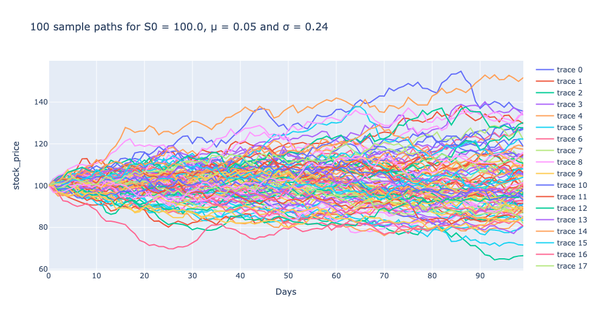
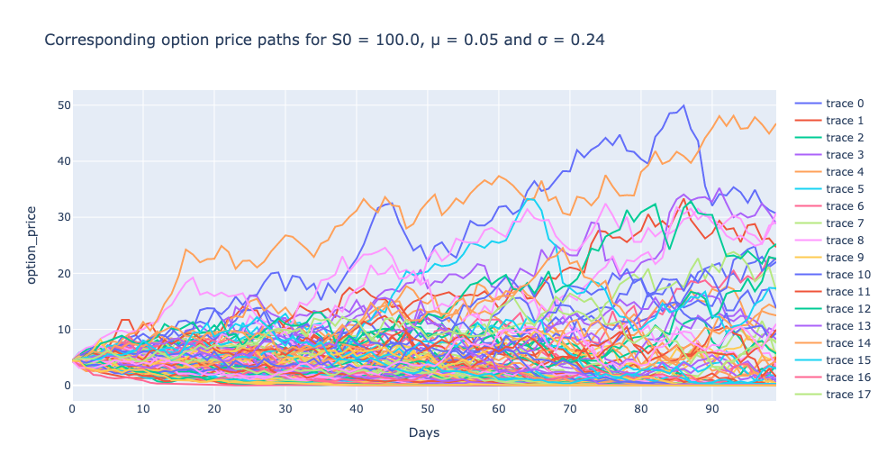
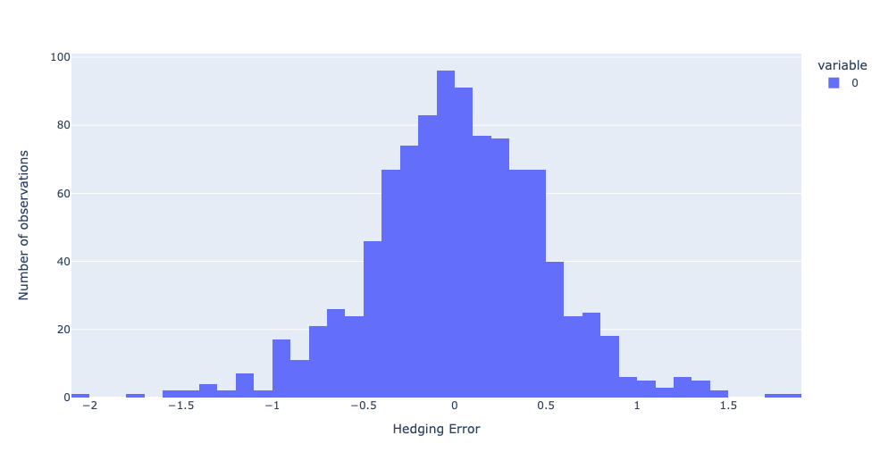
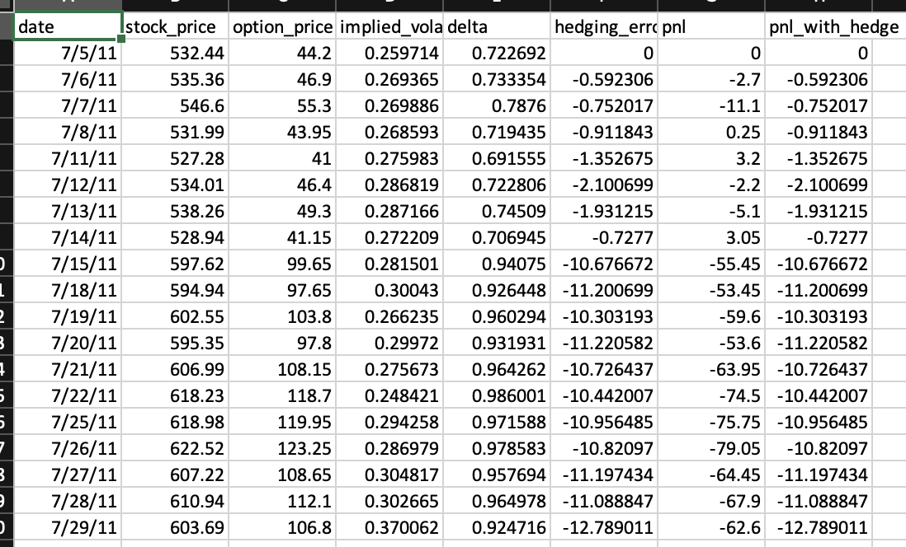
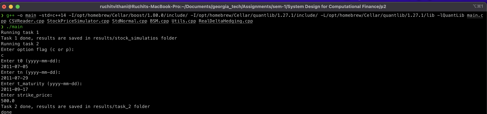
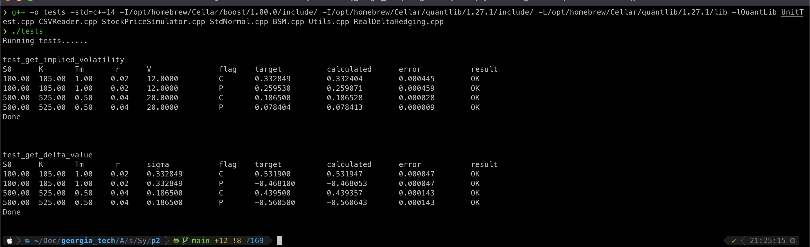

# Dynamic Delta Hedging
* Author: Ruchit Vithani
* GTID: 903929303

# Setup

### Notes: 
* This project uses two third part libraries `boost` and `quantlib`. Please install them before proceeding to compilation. 
* Also make sure that the installation paths are correct as per the compilation command. Otherwise, the code will not be able to compile. 

Use the following command to install the libraries. (This project was ran on macOS)
```shell
brew install boost
brew install quantlib
```

Make sure that the following paths are non-empty after installation to make sure  that the libraries are installed correctly. 

```shell
/opt/homebrew/Cellar/boost/1.80.0/include/
/opt/homebrew/Cellar/quantlib/1.27.1/include/
```

# Compilation

### Compile project
```shell
g++ -o main -std=c++14 -I/opt/homebrew/Cellar/boost/1.80.0/include/ -I/opt/homebrew/Cellar/quantlib/1.27.1/include/ -L/opt/homebrew/Cellar/quantlib/1.27.1/lib -lQuantLib main.cpp CSVReader.cpp StockPriceSimulator.cpp StdNormal.cpp BSM.cpp Utils.cpp RealDeltaHedging.cpp
```

### Compile Unit Tests
```shell
g++ -o tests -std=c++14 -I/opt/homebrew/Cellar/boost/1.80.0/include/ -I/opt/homebrew/Cellar/quantlib/1.27.1/include/ -L/opt/homebrew/Cellar/quantlib/1.27.1/lib -lQuantLib UnitTest.cpp CSVReader.cpp StockPriceSimulator.cpp StdNormal.cpp BSM.cpp Utils.cpp RealDeltaHedging.cpp
```

# Running

### Run project
```shell
./main
```

### Run unit tests
```shell
./tests
```

# Task 1

### NOTE: All graphics are interactive HTML plots generated using plotly library in python. The HTML file can be accessed in `graphics` directory to make more precise and interactive observations.  

The idea of the task 1 was to simulate 1000 stock price series by assuming that the returns on the stock are normally distributed. 
Based on this assumption and the parameters given in the pdf file, 1000 stock price series were generated and out of those 1000 series, 100 series were randomly sampled to plot. 

Following is the plot of 100 stocks sampled from the set of 1000 paths. 



For the above sample of stocks paths, the option prices at each point of time were calculated using the BS model. 
Following is the plot of corresponding option price paths: 


After computing the price of option at each point in time, we also formed a hedging portfolio using the delta value of an option obtained from BS model. 
The cumulative hedging error for all 1000 sample paths was collected in a list and plotted to observe the distribution of the hedging error.

Following is the plot of distribution of hedging error


## Insights from Task 1 
* In order to verify that our code is working properly, we need to make sure of two things. 
  * One is unit test cases. All critical unit test cases must pass
  * The second important observation we make is that the distribution of hedging error is similar to normal distribution with mean very close to zero. 
    * This observation helps us in verifying that our code is working perfectly fine, and we can use this to test on the real market data in task 2. 
* The aim of delta hedging strategy is to lower or minimize the risk associated with the price movement of an underlying security when we sell an option on that security. 
* By looking at the trajectory of the 100 stock paths, we can remember the binomial model studied in homework 3. 
  * In Binomial model also, the span of possible stock prices grow over time, and we already observed that if we take a considerably small value of time interval for the binomial model, the price of the option calculated using binomial model get closer and closer to BS model.

# Task 2

* In task 2, our aim is to validate the delta hedging strategy on the real world market data of Google. We take the parameters given in the task 2 description and apply the delta hedging strategy for the start date `t0 = 2011-05-07`, last date  `Tn = 2011-07-29`, the maturity time of option `T = 2011-09-17` and the strike price `K = 500`. 
* Following is the result obtained from task 2. 


## Insights from Task 2 
* As we can clearly see from the results above, the dynamic delta hedging strategy helps significantly in reducing the loss. 
* Compare the PNL with hedging and without hedging. Without hedging, the PNL is -62.6 and on the other hand, with using hedging strategy, the loss is minimised significantly to -12.79. 
* Thus, by using delta hedging strategy, we minimize the risk, and we can use this strategy for the practical purposes. 

### Snapshot of running both tasks



# Unit Tests
* We test two critical functions in this project. 
1. `get_implied_volatility`: This function was implemented to estimate the volatility of a stock option using inverse black-scholes formula. This was implemented using the binary search algorithm to estimate the volatility. Since the binary search algorithm is a complex search algorithm, it is critical to test this function to make sure that the binary search we implemented is working as expected. Additionally, the implied volatility is used in several downstream equations in the project. Thus, it is very critical to test this function. 
2. `get_delta_value`: This was the second critical function that required thorough end-to-end testing. The reason behind this argument is that this function uses the standard normal cdf function, which was implemented manually without taking help from any library. Whenever we implement any function, it is super critical to test that function thoroughly. Thus, we also write test cases for this function. 

The true value for unit test cases were taken with the help of online calculator, which can be found on this url: https://optioncreator.com/options-calculator

Following screenshot illustrates the testing of the above functions using UnitTest class. One can also test the functions by running tests manually using the command described in the `compilation` and `running` sections. 



# Code Structure

Here we describe the classes and key functions implemented by those classes. 
The code was designed by taking into consideration all the principles of OOP and with the goal of making it as much generic and reusable as possible. 

## Key classes

* `BSM`: Implements the black-scholes model. 
  * Key methods are: 
    * `BSM_Pricer();`: Prices an option using BS formula
    * `getDeltaValue();`: Computes the delta value of an option

* `CSVReader`: A generic CSVReader class that can read any csv irrespective of number of columns in that csv. 
  * Key methods: 
    * `read_csv(vector<vector<string>> &res, const string& path, int ncols);`: Reads CSV from path and stores it in `vector<vector<string>>` res.
    * `to_csv(vector<vector<string>> &res, const string &path, const string& header)`: Save any CSV file locally
    * `cast_to_double(const vector<string> &source, vector<double> &target)`: Helper function to cast a string column of csv to double
    * `cast_to_string(const vector<double> &source, vector<string> &target) `: Helper function to cast the double column back to string. This is helpful when saving csv to local machine.
* `RealDeltaHedging`: Performs delta hedging strategy on the real world market data from Google. 
  * `get_implied_volatility`: A function that computes implied volatility using binary search algorithm. 
  * `run_delta_hedging_on_real_data`: Runs the delta hedging on the Google data
* `StdNormal`: 
  * Generates a random variable from std. normal distribution.
  * Computes the CDF of normal distribution. 
* `Utils`: Provides various utility functions described below
  * `read_inputs`: Reads inputs from the user
  * `convert_percent_to_decimal`: Converts percentages to decimals
  * `get_op_prices`: Computes option prices from bid-ask spreads
* `UnitTest`: Unit test functions described in the UnitTest section

#Conclusion 
* The outcome of this project is to learn about dynamic delta hedging strategy and how it can be implemented to lower the risks associated with the price movements of security when selling an options. 
* We observed that it is completely practical to use this strategy for the real world problems
